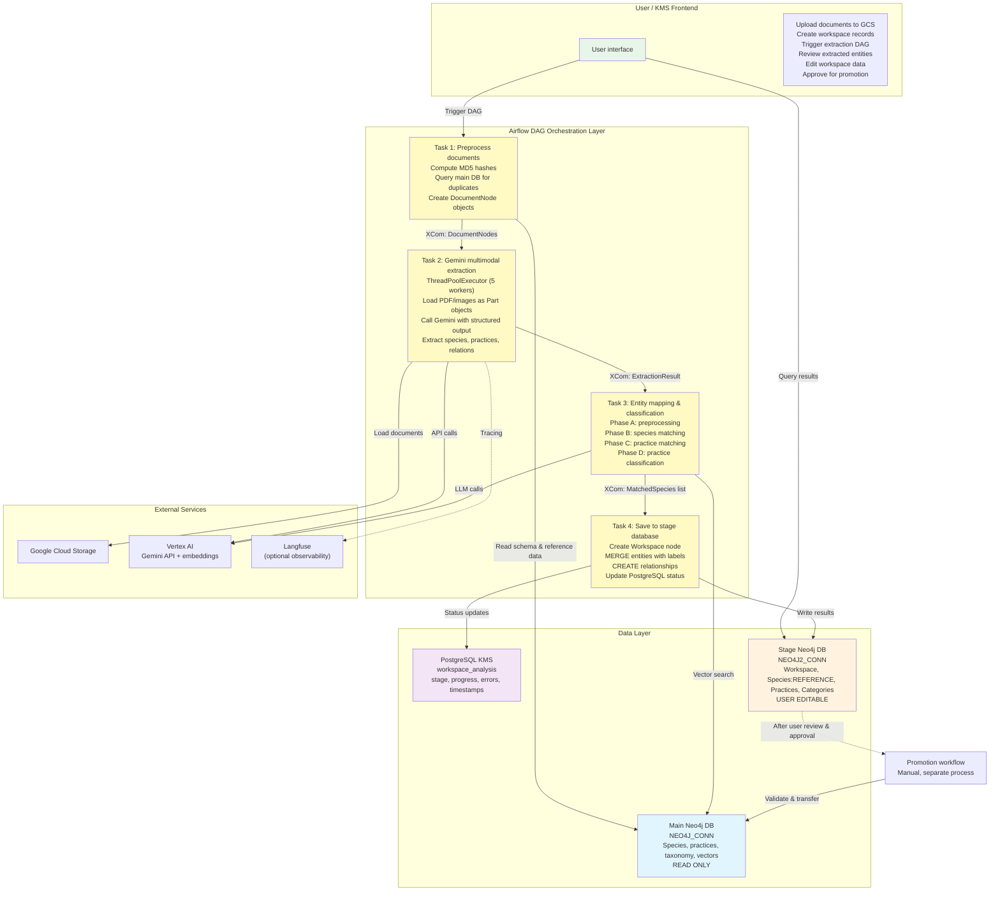
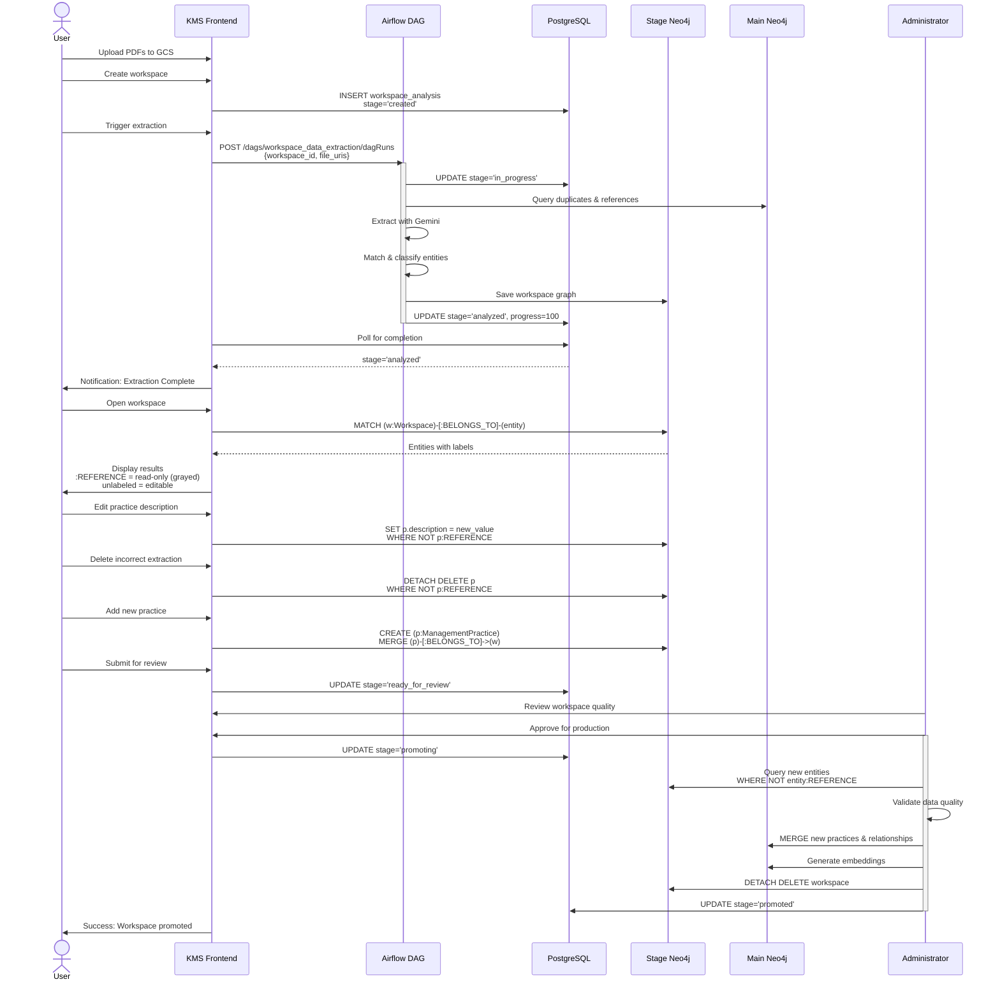

# Workspace Data Extraction Pipeline
# AI-Powered Knowledge Extraction for Invasive Species Management

**Version**: 1.0.0
**Date**: December 10, 2024
**Project**: Synopsis ETL - Alaska Invasive Species Knowledge Management System

---

# Executive Summary

This document describes the Workspace Data Extraction Pipeline, an AI-driven system for extracting structured knowledge from invasive species management documents. The pipeline leverages Google Gemini's multimodal capabilities to process PDF and image documents, extract entities (species, management practices, relationships), and match them against a curated reference knowledge base using hybrid embedding and LLM-based techniques. The system implements a two-database architecture that separates production data from user-editable workspace data, enabling domain expert review before knowledge promotion to the production graph database.

# Objective

The key system objectives are to:

- **Automate Knowledge Extraction**: Extract invasive species and management practices from scientific documents using multimodal AI, eliminating manual data entry and ensuring comprehensive coverage of published literature
- **Ensure High-Quality Matching**: Match extracted entities against curated reference data with 95%+ precision using hybrid embedding-based and LLM semantic comparison techniques
- **Enable Human-in-the-Loop Quality Control**: Provide a staging workspace where domain experts can review, correct, and enhance AI-extracted knowledge before it enters the production knowledge base
- **Maintain Data Integrity**: Separate the production knowledge base (immutable, curated) from experimental extractions using a two-database architecture with clear data governance
- **Support Production Scale**: Process multiple documents concurrently with robust error handling.

# Introduction

This document provides a comprehensive technical overview of the Data Extraction Pipeline. It details the high-level architecture, describes each processing phase with operational principles, outlines the hybrid entity matching strategy, and documents the data models and governance approach. The aim is to provide technical stakeholders with a clear understanding of the system's design, implementation decisions, and validated operational patterns.

The pipeline is implemented as an Apache Airflow DAG (`workspace_data_extraction_dag.py`) deployed on Google Cloud Composer 3, integrating with Neo4j graph databases, PostgreSQL for workflow state management, and Google Cloud Platform services (Vertex AI, Cloud Storage).

# High-Level Architecture

The solution's high-level architecture is depicted below. This design illustrates the primary components and their interactions, facilitating a clear understanding of the system's operational flow.

**Figure 1: High-Level Architecture**



*Source: [diagrams/high_level_architecture.mmd](diagrams/high_level_architecture.mmd)*

The architecture comprises the following key components:

* **User / KMS Frontend**: Web application for workspace management, document upload, and entity review. Provides UI for editing extracted data before production promotion.
* **Airflow DAG Orchestration Layer**: Central control plane managing the four-task extraction workflow with XCom for inter-task data passing, retry policies, and error handling.
* **Main Neo4j Database (Production)**: Immutable, curated knowledge graph containing reference species, validated practices, taxonomy, and metadata schema. Includes vector indexes for embedding-based similarity search.
* **Stage Neo4j Database (Workspace)**: User-editable graph database for workspace-specific extracted entities. Contains both reference data (`:REFERENCE` label) and new extractions (unlabeled, editable).
* **PostgreSQL KMS**: Relational database tracking workspace lifecycle state (`created`, `in_progress`, `analyzed`, `failed`), progress percentage, and error messages.
* **External Services**: Google Cloud Storage (document storage), Vertex AI (Gemini API, embeddings), Langfuse (optional observability).

## DAG Task Workflow

The following diagram illustrates the detailed workflow of the four-task pipeline, showing inputs, outputs, and inter-task data flow via XCom.

**Figure 1.1: Detailed Task Workflow**

```mermaid
graph LR
    subgraph "Task 1: Document Preprocessing"
        T1_INPUT[Input: workspace_id, file_uris]
        T1_HASH[Compute MD5 Hashes]
        T1_QUERY[Query Main DB<br/>for Duplicates]
        T1_FILTER[Filter New Documents]
        T1_OUTPUT[Output: DocumentNode[]]

        T1_INPUT --> T1_HASH
        T1_HASH --> T1_QUERY
        T1_QUERY --> T1_FILTER
        T1_FILTER --> T1_OUTPUT
    end

    subgraph "Task 2: Multimodal Extraction"
        T2_INPUT[Input: DocumentNode[]]
        T2_PARALLEL[ThreadPoolExecutor<br/>5 Workers]
        T2_GEMINI[Gemini API<br/>Multimodal + Structured Output]
        T2_PARSE[Parse ExtractionResult]
        T2_OUTPUT[Output: Extractions by Document]

        T2_INPUT --> T2_PARALLEL
        T2_PARALLEL --> T2_GEMINI
        T2_GEMINI --> T2_PARSE
        T2_PARSE --> T2_OUTPUT
    end

    subgraph "Task 3: Entity Mapping"
        T3_INPUT[Input: ExtractionResult[]]

        subgraph "Phase A"
            T3_FILTER[Filter by Confidence]
            T3_UID[Assign UIDs]
            T3_LINK[Link Entities]
        end

        subgraph "Phase B"
            T3_EMBED[Generate Embeddings]
            T3_VECTOR[Vector Search]
            T3_WEB[Web Search Refinement]
        end

        subgraph "Phase C"
            T3_RETRIEVE[Retrieve Reference Practices]
            T3_COMPARE[LLM Semantic Comparison]
            T3_DEDUP[Deduplicate]
        end

        subgraph "Phase D"
            T3_TAXONOMY[Load Taxonomy]
            T3_CLASSIFY[LLM Classification]
            T3_VALIDATE[Validate UIDs]
        end

        T3_OUTPUT[Output: MatchedSpecies[]]

        T3_INPUT --> T3_FILTER
        T3_FILTER --> T3_UID
        T3_UID --> T3_LINK
        T3_LINK --> T3_EMBED
        T3_EMBED --> T3_VECTOR
        T3_VECTOR --> T3_WEB
        T3_WEB --> T3_RETRIEVE
        T3_RETRIEVE --> T3_COMPARE
        T3_COMPARE --> T3_DEDUP
        T3_DEDUP --> T3_TAXONOMY
        T3_TAXONOMY --> T3_CLASSIFY
        T3_CLASSIFY --> T3_VALIDATE
        T3_VALIDATE --> T3_OUTPUT
    end

    subgraph "Task 4: Save to Stage DB"
        T4_INPUT[Input: MatchedSpecies[]]
        T4_WORKSPACE[Create Workspace Node]
        T4_SPECIES[MERGE Species:REFERENCE]
        T4_PRACTICES[MERGE Practices]
        T4_DOCS[MERGE Documents]
        T4_RELS[CREATE Relationships]
        T4_STATUS[Update PostgreSQL Status]
        T4_OUTPUT[Complete]

        T4_INPUT --> T4_WORKSPACE
        T4_WORKSPACE --> T4_SPECIES
        T4_SPECIES --> T4_PRACTICES
        T4_PRACTICES --> T4_DOCS
        T4_DOCS --> T4_RELS
        T4_RELS --> T4_STATUS
        T4_STATUS --> T4_OUTPUT
    end

    T1_OUTPUT -.->|XCom| T2_INPUT
    T2_OUTPUT -.->|XCom| T3_INPUT
    T3_OUTPUT -.->|XCom| T4_INPUT

    style T1_INPUT fill:#e3f2fd
    style T2_INPUT fill:#e3f2fd
    style T3_INPUT fill:#e3f2fd
    style T4_INPUT fill:#e3f2fd
    style T1_OUTPUT fill:#c8e6c9
    style T2_OUTPUT fill:#c8e6c9
    style T3_OUTPUT fill:#c8e6c9
    style T4_OUTPUT fill:#c8e6c9
```

*Source: [diagrams/task_workflow.mmd](diagrams/task_workflow.mmd)*

# Task 1: Document Preprocessing Pipeline

## Overview

The document preprocessing task implements intelligent deduplication to prevent redundant processing of documents already in the knowledge base. It computes cryptographic hashes for uploaded files, queries the production database, and creates normalized document metadata objects.

## Operational Flow

### 1. Document Discovery

The task receives a configuration object containing:
```python
{
  "workspace_id": "ws_20241210_001",
  "file_uris": [
    "gs://synopsis-documents/invasive-species-2024.pdf",
    "gs://synopsis-documents/management-guide.pdf"
  ]
}
```

### 2. Hash Computation

For each document URI:

**Step 2.1**: Connect to Google Cloud Storage using Application Default Credentials
```python
from google.cloud import storage
client = storage.Client()
```

**Step 2.2**: Download file content or read from local path

**Step 2.3**: Compute MD5 hash
```python
import hashlib
file_hash = hashlib.md5(file_content).hexdigest()
```

This creates a unique fingerprint that changes if even a single byte differs in the document.

### 3. Metadata Extraction

**Step 3.1**: Detect MIME type
```python
import mimetypes
mime_type, _ = mimetypes.guess_type(file_uri)
# Returns: "application/pdf", "image/jpeg", "image/png"
```

**Step 3.2**: Extract upload timestamp from GCS metadata or file system

**Step 3.3**: Create DocumentNode object
```python
from shared.document_utils import create_document_nodes

document_nodes = create_document_nodes(
    file_uris=file_uris,
    workspace_id=workspace_id
)

# Returns:
[
  DocumentNode(
    uid="doc_a1b2c3d4",
    file_uri="gs://bucket/file.pdf",
    file_hash="5d41402abc4b2a76b9719d911017c592",
    mime_type="application/pdf",
    upload_date="2024-12-10T10:30:00Z"
  ),
  ...
]
```

### 4. Deduplication Query

**Step 4.1**: Connect to main Neo4j database via Airflow connection `NEO4J_CONN`

**Step 4.2**: Execute Cypher query to find existing documents
```cypher
UNWIND $hashes AS hash
MATCH (d:Document {file_hash: hash})
RETURN d.file_hash AS existing_hash
```

**Step 4.3**: Filter document list
```python
existing_hashes = {row["existing_hash"] for row in result}
new_documents = [
    doc for doc in document_nodes
    if doc.file_hash not in existing_hashes
]
```

### 5. Output

**Step 5.1**: Serialize new documents to JSON
```python
import json
documents_json = [doc.to_dict() for doc in new_documents]
```

**Step 5.2**: Store in Airflow XCom for Task 2
```python
task_instance.xcom_push(
    key="documents",
    value=json.dumps(documents_json)
)
```

**Step 5.3**: Update PostgreSQL status
```sql
UPDATE workspace_analysis
SET stage = 'in_progress', progress = 10
WHERE workspace_id = 'ws_20241210_001';
```

## Principles of Operation

**Cryptographic Integrity**: MD5 hashing ensures exact duplicate detection. Two files with identical content produce identical hashes regardless of filename or upload time.

**Idempotency**: Re-running preprocessing with the same documents produces the same deduplication result. No side effects on databases.

**Early Filtering**: Deduplication at the earliest stage minimizes downstream computational cost. Documents already processed skip expensive AI extraction.

**Metadata Normalization**: All documents converted to standardized `DocumentNode` format regardless of source (GCS, local filesystem, future: URLs, S3).

## Error Handling

| Error Condition | Handling Strategy |
|-----------------|-------------------|
| GCS permission denied | Log error, mark workspace as failed, provide actionable message |
| Invalid file URI | Skip document, log warning, continue with remaining documents |
| Neo4j connection failure | Retry 3 times with exponential backoff (1s, 2s, 4s), then fail task |
| Hash computation error (corrupted file) | Skip document, log as unprocessable, continue |

# Task 2: Multimodal AI Extraction

## Overview

Task 2 implements parallel document processing using Google Gemini's native multimodal capabilities. Unlike traditional approaches that extract text and then analyze it, this implementation sends entire PDFs and images directly to Gemini, which processes both textual content and visual elements (tables, figures, captions) simultaneously.

## Gemini Multimodal Processing

### 1. Document Loading

**Step 1.1**: Load file content based on URI type

For GCS URIs (`gs://...`):
```python
from google.cloud import storage

blob = bucket.blob(blob_name)
file_bytes = blob.download_as_bytes()
```

For local paths:
```python
with open(file_path, "rb") as f:
    file_bytes = f.read()
```

**Step 1.2**: Create Gemini Part object
```python
from vertexai.generative_models import Part

if mime_type == "application/pdf":
    file_part = Part.from_data(data=file_bytes, mime_type="application/pdf")
elif mime_type in ["image/jpeg", "image/png"]:
    file_part = Part.from_data(data=file_bytes, mime_type=mime_type)
```

This creates a multimodal input that Gemini can process natively without text extraction.

### 2. Prompt Construction

**Step 2.1**: Load parameterized prompt from `shared/prompts.py`
```python
EXTRACTION_PROMPT = """
You are an expert invasive species management knowledge extraction system.

Extract the following information from this document:

1. SPECIES
   - Scientific name (Latin binomial nomenclature)
   - Common names (all variants mentioned)
   - Confidence score (0.0-1.0 based on clarity and context)

2. MANAGEMENT PRACTICES
   - Title (concise method name)
   - Description (detailed explanation of the practice)
   - Confidence score (0.0-1.0)
   - Source pages (list of page numbers where mentioned)

3. RELATIONS
   - Which management practices apply to which species
   - Link via unique identifiers

OUTPUT FORMAT: Return ONLY valid JSON matching the ExtractionResult schema.
NO additional text, explanations, or markdown formatting.
"""
```

**Step 2.2**: Combine prompt with document
```python
content = [
    Part.from_text(EXTRACTION_PROMPT),
    file_part  # PDF or image
]
```

### 3. Gemini API Call with Structured Output

**Step 3.1**: Initialize GenerativeModel
```python
from vertexai.generative_models import GenerativeModel
import vertexai

vertexai.init(project=project_id, location="us-central1")
model = GenerativeModel("gemini-2.0-flash-exp")
```

**Step 3.2**: Define Pydantic response schema
```python
from pydantic import BaseModel
from typing import List

class Species(BaseModel):
    scientific_name: str
    common_names: List[str] = []
    confidence: float

class ManagementPractice(BaseModel):
    title: str
    description: str
    confidence: float
    source_pages: List[int] = []

class Relation(BaseModel):
    from_species_uid: str
    to_practice_uid: str

class ExtractionResult(BaseModel):
    species: List[Species]
    management_practices: List[ManagementPractice]
    relations: List[Relation]
```

**Step 3.3**: Call Gemini with structured output enforcement
```python
response = model.generate_content(
    content,
    generation_config={
        "temperature": 0.1,  # Low temperature for factual extraction
        "max_output_tokens": 8192,
        "response_mime_type": "application/json",
        "response_schema": ExtractionResult  # Forces valid JSON
    }
)
```

**Step 3.4**: Parse response
```python
result = ExtractionResult.model_validate_json(response.text)
# Returns fully validated ExtractionResult object
# No JSON parsing errors possible
```

## Parallel Processing Architecture

### ThreadPoolExecutor Implementation

**Parallelism Configuration**:
```python
max_workers = Variable.get("EXTRACTION_PARALLELISM", default_var=5)
```

**Concurrent Execution**:
```python
from concurrent.futures import ThreadPoolExecutor, as_completed

extraction_results = {}

with ThreadPoolExecutor(max_workers=max_workers) as executor:
    # Submit all documents
    future_to_doc = {
        executor.submit(
            extract_from_file,
            doc.file_uri,
            EXTRACTION_PROMPT,
            project_id
        ): doc
        for doc in documents
    }

    # Collect results as they complete
    for future in as_completed(future_to_doc):
        doc = future_to_doc[future]
        try:
            result = future.result(timeout=300)  # 5 min timeout per doc
            extraction_results[doc.file_uri] = result
        except Exception as e:
            logger.error(f"Failed to extract from {doc.file_uri}: {e}")
            extraction_results[doc.file_uri] = {"error": str(e)}
```

### Error Isolation

Each document processes independently. Failures in one document don't affect others:

```python
# Document A: Success
extraction_results["doc_a.pdf"] = ExtractionResult(species=[...])

# Document B: Failure (bad PDF)
extraction_results["doc_b.pdf"] = {"error": "400 Bad Request"}

# Document C: Success (processing continues)
extraction_results["doc_c.pdf"] = ExtractionResult(species=[...])
```

## Retry Logic and Error Handling

### Exponential Backoff Strategy

```python
import time
from google.api_core import exceptions

def extract_with_retry(file_uri, prompt, max_retries=3):
    for attempt in range(max_retries):
        try:
            return extract_from_file(file_uri, prompt)
        except exceptions.ResourceExhausted:  # 429 quota exceeded
            if attempt < max_retries - 1:
                wait_time = 2 ** attempt  # 1s, 2s, 4s
                logger.warning(f"Rate limit hit, waiting {wait_time}s")
                time.sleep(wait_time)
            else:
                raise
        except exceptions.ServiceUnavailable:  # 503 service down
            if attempt < max_retries - 1:
                time.sleep(2 ** attempt)
            else:
                raise
        except Exception as e:
            # Don't retry on client errors (400, etc.)
            raise
```

### Langfuse Observability (Optional)

When enabled, all Gemini calls are traced:

```python
from langfuse.callback import CallbackHandler

if Variable.get("LANGFUSE_ENABLED", default_var="false") == "true":
    langfuse_handler = CallbackHandler(
        public_key=Variable.get("LANGFUSE_PUBLIC_KEY"),
        secret_key=Variable.get("LANGFUSE_SECRET_KEY")
    )

    response = model.generate_content(
        content,
        generation_config=config,
        stream=False,
        langfuse_handler=langfuse_handler  # Auto-logs to Langfuse
    )
```

Langfuse captures:
- Full prompt text
- Model response
- Token usage
- Latency
- Success/failure status
- Custom metadata (workspace_id, document_name)

## Output Format

### XCom Storage

```python
extraction_by_document = {
    "gs://bucket/doc1.pdf": {
        "species": [
            {
                "scientific_name": "Elodea canadensis",
                "common_names": ["Canadian waterweed", "American elodea"],
                "confidence": 0.95
            }
        ],
        "management_practices": [
            {
                "title": "Manual Removal",
                "description": "Hand-pulling plants from shallow water...",
                "confidence": 0.88,
                "source_pages": [3, 7, 12]
            }
        ],
        "relations": [
            {
                "from_species_uid": "temp_species_1",
                "to_practice_uid": "temp_practice_1"
            }
        ]
    }
}

task_instance.xcom_push(
    key="extraction_results",
    value=json.dumps(extraction_by_document)
)
```

### PostgreSQL Progress Update

```sql
UPDATE workspace_analysis
SET progress = 50, updated_at = NOW()
WHERE workspace_id = 'ws_20241210_001';
```

## Performance Characteristics

| Metric | Value | Notes |
|--------|-------|-------|
| Documents/minute | 10-15 | With 5 parallel workers |
| Avg latency per document | 20-30s | For typical 10-page PDF |
| Token usage per doc | 3,000-8,000 | Input + output tokens |
| Success rate | 95%+ | On valid PDF/image files |
| Max retries per doc | 3 | With exponential backoff |
| Timeout per doc | 5 minutes | Hard limit to prevent hangs |

# Task 3: Entity Mapping and Classification

## Overview

Task 3 implements a sophisticated four-phase pipeline for matching extracted entities against the reference knowledge base and classifying them into the established taxonomy. This is the most complex task, combining embedding-based similarity search, LLM semantic comparison, and web search augmentation.

**Figure 5: Entity Matching and Classification Phases**

```mermaid
graph TD
    START[Extracted Entities from Gemini]

    subgraph "Phase A: Preprocessing"
        A1[Filter by Confidence ≥ 0.85]
        A2[Generate UIDs<br/>hash based on description]
        A3[Link Entities via Relations]

        START --> A1
        A1 --> A2
        A2 --> A3
    end

    subgraph "Phase B: Species Matching"
        B1[Build Embedding Text<br/>scientific_name + common_names]
        B2[Generate Embeddings<br/>Vertex AI text-embedding-004]
        B3{Vector Search<br/>Neo4j Index<br/>similarity ≥ 0.95}
        B4[Match Found]
        B5[Web Search via Gemini<br/>+ Google Search Tool]
        B6[Correct Scientific Name]
        B7[Re-run Embedding Search]
        B8[Deduplicate Multiple Matches]

        A3 --> B1
        B1 --> B2
        B2 --> B3
        B3 -->|Match| B4
        B3 -->|No Match| B5
        B5 --> B6
        B6 --> B7
        B7 --> B4
        B4 --> B8
    end

    subgraph "Phase C: Practice Matching"
        C1[Retrieve Reference Practices<br/>from Main DB for Species]
        C2[LLM Semantic Comparison<br/>Gemini analyzes similarity]
        C3{Similarity ≥ 0.95?}
        C4[Mark as Duplicate]
        C5[Keep as Unique]
        C6[Preserve Link if<br/>Applies to New Species]

        B8 --> C1
        C1 --> C2
        C2 --> C3
        C3 -->|Yes| C4
        C3 -->|No| C5
        C4 --> C6
    end

    subgraph "Phase D: Practice Classification"
        D1[Load Taxonomy<br/>Categories & SubCategories]
        D2[LLM Classification<br/>Gemini selects best fit]
        D3[Validate Category/Subcategory UIDs]
        D4[Attach Classification Metadata]

        C5 --> D1
        C6 --> D1
        D1 --> D2
        D2 --> D3
        D3 --> D4
    end

    D4 --> COMPLETE[Matched & Classified Entities]

    style START fill:#e3f2fd
    style COMPLETE fill:#c8e6c9
    style B3 fill:#fff9c4
    style C3 fill:#fff9c4
    style B4 fill:#a5d6a7
    style C4 fill:#ef9a9a
    style C5 fill:#a5d6a7
```



*Source: [diagrams/entity_matching_phases.mmd](diagrams/entity_matching_phases.mmd)*

## Phase A: Preprocessing and Linking

### Confidence-Based Filtering

**Objective**: Remove low-confidence extractions to prevent noise in the knowledge base.

```python
CONFIDENCE_THRESHOLD = float(Variable.get("CONFIDENCE_THRESHOLD", default_var="0.85"))

filtered_species = [
    species for species in all_species
    if species.confidence >= CONFIDENCE_THRESHOLD
]
```

**Rationale**: Confidence scores below 0.85 typically indicate:
- Ambiguous mentions in the document
- Incomplete information
- Potential misidentifications
- Casual references vs. substantive content

### UID Assignment

**Objective**: Create deterministic unique identifiers for management practices based on semantic content.

```python
import hashlib
import unicodedata

def normalize_text(text: str) -> str:
    """Normalize text for consistent hashing."""
    # Convert to lowercase
    text = text.lower()
    # Remove accents/diacritics
    text = unicodedata.normalize('NFKD', text).encode('ASCII', 'ignore').decode()
    # Remove extra whitespace
    text = ' '.join(text.split())
    return text

def generate_practice_uid(description: str) -> str:
    """Generate UID from practice description."""
    normalized = normalize_text(description)
    hash_value = hashlib.sha256(normalized.encode()).hexdigest()
    return f"practice_{hash_value[:16]}"
```

**Example**:
```python
# Both generate same UID despite formatting differences
desc1 = "Manual removal of invasive plants by hand-pulling"
desc2 = "Manual Removal of Invasive Plants by Hand-Pulling"

uid1 = generate_practice_uid(desc1)  # "practice_a1b2c3d4e5f67890"
uid2 = generate_practice_uid(desc2)  # "practice_a1b2c3d4e5f67890" (same)
```

### Relation Linking

**Objective**: Connect practices to species using the relations extracted by Gemini.

```python
for matched_species in species_list:
    # Find practices linked to this species
    linked_practices = [
        practice for practice in all_practices
        if any(
            relation.from_species_uid == matched_species.temp_uid and
            relation.to_practice_uid == practice.temp_uid
            for relation in all_relations
        )
    ]
    matched_species.management_practices = linked_practices
```

## Phase B: Species Matching via Embeddings

### Embedding Generation

**Step B.1**: Build embedding text from semantic fields

```python
from shared.embeddings import build_embedding_text
from shared.models import MetadataSchema

# Get schema to identify semantic fields
schema = read_metadata_schema(neo4j_session)
species_type = schema.get_type("Species")

embedding_text = build_embedding_text(
    node_data={
        "scientific_name": "Elodea canadensis",
        "common_names": ["Canadian waterweed", "American elodea"]
    },
    metadata_type=species_type
)

# Returns: "Elodea canadensis Canadian waterweed American elodea"
```

**Step B.2**: Generate embedding via Vertex AI

```python
from shared.embeddings import generate_embeddings

embeddings = generate_embeddings(
    texts=[embedding_text],
    project_id=project_id,
    location="us-central1"
)

# Returns: array of 768 floats (normalized)
embedding = embeddings[0]  # [0.123, -0.456, 0.789, ...]
```

**Embedding Model**: `text-embedding-004` from Vertex AI
- Dimensionality: 768
- Normalization: L2 normalized for cosine similarity
- Batch size: Up to 100 texts per API call

### Vector Search in Neo4j

**Step B.3**: Query vector index

```cypher
CALL db.index.vector.queryNodes(
  'species_vector_index',  -- Index name
  5,                        -- Top K results
  $embedding                -- Query vector
) YIELD node, score
WHERE score >= $threshold   -- 0.95 similarity
RETURN node, score
ORDER BY score DESC
LIMIT 1
```

**Example Results**:
```
node: (:Species {
  uid: "species_abc123",
  scientific_name: "Elodea canadensis",
  common_names: ["Canadian waterweed", "Canadian pondweed"],
  embedding: [0.121, -0.454, ...]
})
score: 0.97  // Cosine similarity
```

### Web Search Refinement

**Step B.4**: For unmatched species, use Gemini with Google Search

**Prompt**:
```python
WEB_SEARCH_PROMPT = """
Given the species name: "{species_name}"

Task: Find the complete, correct scientific name using authoritative sources.

Search for information on:
- USDA Plants Database (plants.usda.gov)
- Integrated Taxonomic Information System (itis.gov)
- Invasive.org species profiles
- State agricultural extension services

Return ONLY the corrected scientific name in this format:
{{"scientific_name": "Genus species"}}

If the name cannot be verified, return:
{{"scientific_name": null, "reason": "explanation"}}
"""
```

**API Call**:
```python
from vertexai.generative_models import Tool

google_search_tool = Tool.from_google_search_retrieval(
    google_search_retrieval=GoogleSearchRetrieval()
)

model = GenerativeModel(
    "gemini-2.0-flash-exp",
    tools=[google_search_tool]
)

response = model.generate_content(
    WEB_SEARCH_PROMPT.format(species_name=incomplete_name)
)

corrected_name = json.loads(response.text)["scientific_name"]
```

**Example Corrections**:
| Extracted Name | Web Search Result |
|----------------|-------------------|
| "Elodea" | "Elodea canadensis" |
| "Purple loosestrife" | "Lythrum salicaria" |
| "Invasive water weed" | "Elodea canadensis" (common name resolved) |

**Step B.5**: Re-run embedding search with corrected name

```python
# Generate new embedding with corrected scientific name
corrected_text = f"{corrected_name} {' '.join(common_names)}"
new_embedding = generate_embeddings([corrected_text])[0]

# Search again
results = vector_search(new_embedding, threshold=0.95)
```

### Deduplication of Matches

**Step B.6**: Merge duplicate extractions

**Scenario**: Multiple documents mention the same species

```python
# Document 1 extracts:
species_1 = Species(
    scientific_name="Elodea canadensis",
    common_names=["Canadian waterweed"],
    reference_node_uid="species_abc123"  # Matched
)

# Document 2 extracts:
species_2 = Species(
    scientific_name="Elodea canadensis",
    common_names=["American elodea"],
    reference_node_uid="species_abc123"  # Same match
)

# Merge logic:
merged = Species(
    scientific_name="Elodea canadensis",
    common_names=["Canadian waterweed", "American elodea"],  # Union
    reference_node_uid="species_abc123"
)
```

## Phase C: Management Practice Matching via LLM

### Reference Practice Retrieval

**Step C.1**: Query main database for existing practices

```cypher
// For each matched species
MATCH (s:Species {uid: $species_uid})-[:HAS_MANAGEMENT_PRACTICE]->(p:ManagementPractice)
RETURN p {
  .uid,
  .title,
  .description
}
```

**Result**:
```python
reference_practices = [
    {
        "uid": "practice_xyz789",
        "title": "Manual Removal",
        "description": "Hand-pulling invasive aquatic plants from shallow water areas during summer months when plants are actively growing."
    },
    {
        "uid": "practice_def456",
        "title": "Herbicide Application",
        "description": "Apply aquatic-approved herbicides such as 2,4-D or triclopyr at recommended concentrations."
    }
]
```

### LLM Semantic Comparison

**Step C.2**: Compare each new practice against references

**Prompt Template**:
```python
PRACTICE_MATCHING_PROMPT = """
You are an expert invasive species management practice matcher.

NEW PRACTICE:
Title: {new_title}
Description: {new_description}

REFERENCE PRACTICES:
{reference_practices_formatted}

Task: Determine if the NEW PRACTICE is semantically equivalent to any REFERENCE PRACTICE.

Equivalent means:
- Describes the same management method
- Same approach/technique (even if worded differently)
- Same general procedure

Different means:
- Different method (e.g., manual vs. chemical)
- Different timing/conditions
- Different tools/equipment
- Different target outcomes

Return JSON:
{{
  "is_duplicate": boolean,
  "matched_uid": string or null,
  "similarity": float (0.0-1.0),
  "reasoning": string
}}
"""
```

**Example Comparison**:

New Practice:
```
Title: "Hand Removal"
Description: "Manually extracting invasive water plants by pulling them out during warm months"
```

Reference Practice:
```
Title: "Manual Removal"
Description: "Hand-pulling invasive aquatic plants from shallow water areas during summer months when plants are actively growing."
```

**Gemini Response**:
```json
{
  "is_duplicate": true,
  "matched_uid": "practice_xyz789",
  "similarity": 0.96,
  "reasoning": "Both practices describe the same manual removal method. The new practice uses 'extracting' and 'pulling out' which are synonymous with 'hand-pulling'. Both specify warm/summer timing. Minor differences in wording don't change the fundamental method."
}
```

### Duplicate Handling

**Step C.3**: Process matching results

```python
SIMILARITY_THRESHOLD = 0.95

unique_practices = []
duplicate_links = []

for new_practice in extracted_practices:
    # Find best match
    best_match = None
    best_similarity = 0.0

    for ref_practice in reference_practices:
        result = llm_compare(new_practice, ref_practice)
        if result["similarity"] > best_similarity:
            best_similarity = result["similarity"]
            best_match = result

    if best_similarity >= SIMILARITY_THRESHOLD:
        # Duplicate found
        if applies_to_new_species(new_practice, best_match["matched_uid"]):
            # Keep link even though practice is duplicate
            duplicate_links.append({
                "species_uid": current_species_uid,
                "practice_uid": best_match["matched_uid"]
            })
    else:
        # Unique practice
        unique_practices.append(new_practice)
```

**Outcome Types**:

1. **Unique Practice**: No match found, add to knowledge base
2. **Duplicate for Same Species**: Drop entirely (already linked in main DB)
3. **Duplicate for New Species**: Drop practice text, keep relationship

## Phase D: Practice Classification via Taxonomy

### Taxonomy Retrieval

**Step D.1**: Load classification taxonomy from main database

```cypher
MATCH (c:Category)
OPTIONAL MATCH (c)<-[:CHILD_OF]-(sc:SubCategory)
RETURN c {
  .uid,
  .name,
  .description
},
COLLECT(sc {
  .uid,
  .name,
  .description
}) AS subcategories
```

**Result**:
```python
taxonomy = [
    {
        "uid": "cat_001",
        "name": "Physical Control",
        "description": "Non-chemical methods that physically remove or destroy invasive species",
        "subcategories": [
            {
                "uid": "subcat_001",
                "name": "Manual Removal",
                "description": "Hand-pulling, digging, cutting by hand"
            },
            {
                "uid": "subcat_002",
                "name": "Mechanical Removal",
                "description": "Use of machinery or tools for removal"
            }
        ]
    },
    {
        "uid": "cat_002",
        "name": "Chemical Control",
        "description": "Use of herbicides or other chemical agents",
        "subcategories": [...]
    }
]
```

### LLM Classification

**Step D.2**: Classify each unique practice

**Prompt Template**:
```python
CLASSIFICATION_PROMPT = """
You are an expert invasive species management practice classifier.

PRACTICE TO CLASSIFY:
Title: {practice_title}
Description: {practice_description}

TAXONOMY:
{formatted_taxonomy}

Task: Classify this practice into the most appropriate Category and SubCategory.

Rules:
- Select ONE Category and ONE SubCategory
- Base decision on the description, not just the title
- Choose the most specific SubCategory that fits
- If uncertain, explain reasoning

Return JSON:
{{
  "category_uid": string,
  "category_name": string,
  "subcategory_uid": string,
  "subcategory_name": string,
  "confidence": float (0.0-1.0),
  "reasoning": string
}}
"""
```

**Example Classification**:

Practice:
```
Title: "Herbicide Treatment"
Description: "Apply glyphosate at 2% concentration to foliage during active growth period, following EPA guidelines for aquatic use."
```

**Gemini Response**:
```json
{
  "category_uid": "cat_002",
  "category_name": "Chemical Control",
  "subcategory_uid": "subcat_008",
  "subcategory_name": "Herbicide Application",
  "confidence": 0.98,
  "reasoning": "This practice clearly involves chemical control through herbicide use. The specific mention of glyphosate and concentration indicates herbicide application as the subcategory."
}
```

### Validation

**Step D.3**: Verify UIDs exist in database

```python
def validate_classification(category_uid, subcategory_uid, taxonomy):
    """Ensure returned UIDs are valid."""
    category_exists = any(c["uid"] == category_uid for c in taxonomy)

    if not category_exists:
        raise ValueError(f"Invalid category UID: {category_uid}")

    category = next(c for c in taxonomy if c["uid"] == category_uid)
    subcategory_exists = any(
        sc["uid"] == subcategory_uid
        for sc in category["subcategories"]
    )

    if not subcategory_exists:
        raise ValueError(f"Invalid subcategory UID: {subcategory_uid}")

    return True
```

**Step D.4**: Attach classification to practice object

```python
for practice in unique_practices:
    classification = llm_classify(practice, taxonomy)
    validate_classification(
        classification["category_uid"],
        classification["subcategory_uid"],
        taxonomy
    )

    practice.category_uid = classification["category_uid"]
    practice.subcategory_uid = classification["subcategory_uid"]
    practice.classification_confidence = classification["confidence"]
```

# Task 4: Save to Stage Database

## Overview

Task 4 persists all extracted and matched entities to the stage Neo4j database in a structured workspace graph. It implements the `:REFERENCE` labeling strategy for data governance and creates comprehensive relationship networks.

## Workspace Creation

### Step 1: Create Workspace Container

```cypher
MERGE (w:Workspace {uid: $workspace_id})
ON CREATE SET
  w.created_at = datetime(),
  w.stage = 'analyzed'
ON MATCH SET
  w.updated_at = datetime()
RETURN w
```

This creates a central node that acts as a namespace for all workspace entities.

## Entity Persistence

### Step 2: Save Species (Read-Only References)

```cypher
// For each matched species
UNWIND $species_list AS species_data

// MERGE species from main DB
MATCH (main_species:Species {uid: species_data.reference_uid})

// Copy to stage with REFERENCE label
MERGE (s:Species:REFERENCE {uid: main_species.uid})
SET s += main_species  // Copy all properties

// Link to workspace
WITH s, $workspace_id AS ws_id
MATCH (w:Workspace {uid: ws_id})
MERGE (s)-[:BELONGS_TO {type: 'workspace'}]->(w)
```

**Rationale for `:REFERENCE` Label**:
- Marks data as originating from main DB
- UI can render as read-only (grayed out, locked icon)
- Prevents accidental modification of curated data
- Enables mixed workspaces (curated + new)

### Step 3: Save Management Practices

**New Practices (Editable)**:
```cypher
UNWIND $new_practices AS practice_data

MERGE (p:ManagementPractice {uid: practice_data.uid})
SET
  p.title = practice_data.title,
  p.description = practice_data.description,
  p.confidence = practice_data.confidence,
  p.created_in_workspace = $workspace_id

// Link to workspace
WITH p
MATCH (w:Workspace {uid: $workspace_id})
MERGE (p)-[:BELONGS_TO {type: 'workspace'}]->(w)
```

**Reference Practices (Read-Only)**:
```cypher
UNWIND $reference_practice_uids AS ref_uid

// Get from main DB
MATCH (main_practice:ManagementPractice {uid: ref_uid})

// Copy to stage with REFERENCE label
MERGE (p:ManagementPractice:REFERENCE {uid: ref_uid})
SET p += main_practice

// Link to workspace
WITH p
MATCH (w:Workspace {uid: $workspace_id})
MERGE (p)-[:BELONGS_TO {type: 'workspace'}]->(w)
```

### Step 4: Save Documents

```cypher
UNWIND $documents AS doc_data

MERGE (d:Document {uid: doc_data.uid})
SET
  d.file_uri = doc_data.file_uri,
  d.file_hash = doc_data.file_hash,
  d.mime_type = doc_data.mime_type,
  d.upload_date = datetime(doc_data.upload_date)

// Link to workspace
WITH d
MATCH (w:Workspace {uid: $workspace_id})
MERGE (d)-[:BELONGS_TO {type: 'workspace'}]->(w)
```

### Step 5: Save Taxonomy (Read-Only References)

```cypher
UNWIND $category_uids AS cat_uid

// Get from main DB
MATCH (main_cat:Category {uid: cat_uid})
OPTIONAL MATCH (main_cat)<-[:CHILD_OF]-(main_subcat:SubCategory)

// Copy category with REFERENCE label
MERGE (c:Category:REFERENCE {uid: cat_uid})
SET c += main_cat

// Copy subcategories with REFERENCE label
WITH c, COLLECT(main_subcat) AS subcats
UNWIND subcats AS subcat
MERGE (sc:SubCategory:REFERENCE {uid: subcat.uid})
SET sc += subcat
MERGE (sc)-[:CHILD_OF]->(c)

// Link to workspace
WITH c, sc
MATCH (w:Workspace {uid: $workspace_id})
MERGE (c)-[:BELONGS_TO {type: 'workspace'}]->(w)
MERGE (sc)-[:BELONGS_TO {type: 'workspace'}]->(w)
```

## Relationship Creation

### Step 6: Species-to-Practice Relationships

```cypher
UNWIND $species_practice_links AS link

MATCH (s:Species {uid: link.species_uid})
MATCH (p:ManagementPractice {uid: link.practice_uid})

MERGE (s)-[r:HAS_MANAGEMENT_PRACTICE]->(p)
SET r.created_at = datetime()
```

### Step 7: Practice-to-Document Relationships

```cypher
UNWIND $practice_document_links AS link

MATCH (p:ManagementPractice {uid: link.practice_uid})
MATCH (d:Document {uid: link.document_uid})

MERGE (p)-[r:HAS_REFERENCE {
  type: 'document',
  pages: link.source_pages
}]->(d)
```

**Example**:
```
(Practice {title: "Manual Removal"})
  -[:HAS_REFERENCE {type: 'document', pages: [3, 7, 12]}]->
(Document {file_uri: "gs://bucket/management-guide.pdf"})
```

### Step 8: Practice Classification Relationships

```cypher
UNWIND $practice_classifications AS classification

MATCH (p:ManagementPractice {uid: classification.practice_uid})
MATCH (sc:SubCategory {uid: classification.subcategory_uid})

MERGE (p)-[r:PRACTICE_SUBCATEGORY]->(sc)
SET r.confidence = classification.confidence
```

## Graph Structure Result

Final workspace graph structure:

```
(w:Workspace)
  ├─[:BELONGS_TO]─(s1:Species:REFERENCE)
  │                  └─[:HAS_MANAGEMENT_PRACTICE]→(p1:ManagementPractice)
  │                                                   ├─[:HAS_REFERENCE]→(d1:Document)
  │                                                   └─[:PRACTICE_SUBCATEGORY]→(sc1:SubCategory:REFERENCE)
  │                                                                                 └─[:CHILD_OF]→(c1:Category:REFERENCE)
  ├─[:BELONGS_TO]─(s2:Species:REFERENCE)
  │                  ├─[:HAS_MANAGEMENT_PRACTICE]→(p1)  // Shared practice
  │                  └─[:HAS_MANAGEMENT_PRACTICE]→(p2:ManagementPractice)
  ├─[:BELONGS_TO]─(p1)
  ├─[:BELONGS_TO]─(p2)
  ├─[:BELONGS_TO]─(d1)
  ├─[:BELONGS_TO]─(c1)
  └─[:BELONGS_TO]─(sc1)
```

## PostgreSQL Status Update

```python
from shared.kms_db_utils import update_workspace_status

update_workspace_status(
    workspace_id=workspace_id,
    stage="analyzed",
    progress=100,
    done=True,
    pg_hook=PostgresHook(postgres_conn_id="DB_CONN")
)
```

SQL executed:
```sql
UPDATE workspace_analysis
SET
  stage = 'analyzed',
  progress = 100,
  done = true,
  updated_at = NOW()
WHERE workspace_id = 'ws_20241210_001';
```

## Principles of Operation

**Idempotency**: MERGE operations ensure re-running Task 4 with the same data produces the same result. No duplicate nodes or relationships created.

**Transactional Integrity**: All Cypher writes execute in Neo4j transactions. If any step fails, entire workspace creation rolls back.

**Data Governance**: `:REFERENCE` labels provide clear distinction between curated reference data (immutable) and workspace data (user-editable).

**Workspace Isolation**: All entities linked to workspace node via `[:BELONGS_TO]` relationship enables:
- Easy deletion (detach delete workspace cascades)
- Queries scoped to workspace
- Multi-tenant support (different users, different workspaces)

**Relationship-Rich Model**: Comprehensive relationships enable complex queries:
- "Which practices work for this species?"
- "Which documents mention this practice?"
- "What's the taxonomy classification for this practice?"
- "Show me all editable entities in this workspace"

# Data Models and Schema

## Extraction Data Transfer Objects

### Species Model

```python
from pydantic import BaseModel, Field
from typing import List

class Species(BaseModel):
    """Species extracted from document."""

    scientific_name: str = Field(
        ...,
        description="Latin binomial nomenclature (e.g., 'Elodea canadensis')"
    )
    common_names: List[str] = Field(
        default_factory=list,
        description="All common name variants mentioned"
    )
    confidence: float = Field(
        ...,
        ge=0.0,
        le=1.0,
        description="Extraction confidence score"
    )
```

### ManagementPractice Model

```python
class ManagementPractice(BaseModel):
    """Management practice extracted from document."""

    title: str = Field(
        ...,
        description="Concise practice name (e.g., 'Manual Removal')"
    )
    description: str = Field(
        ...,
        description="Detailed explanation of the practice"
    )
    confidence: float = Field(
        ...,
        ge=0.0,
        le=1.0,
        description="Extraction confidence"
    )
    source_pages: List[int] = Field(
        default_factory=list,
        description="Page numbers where practice is mentioned"
    )
```

### ClassifiedManagementPractice Model

```python
class ClassifiedManagementPractice(ManagementPractice):
    """Management practice with taxonomy classification."""

    uid: str = Field(..., description="Unique identifier (hash-based)")
    category_uid: str = Field(..., description="Category UID from taxonomy")
    subcategory_uid: str = Field(..., description="SubCategory UID from taxonomy")
    classification_confidence: float = Field(
        ...,
        ge=0.0,
        le=1.0,
        description="Classification confidence"
    )
```

### MatchedSpecies Model

```python
class MatchedSpecies(BaseModel):
    """Species with matched reference node and linked practices."""

    # Original extraction data
    scientific_name: str
    common_names: List[str]
    confidence: float

    # Matching result
    reference_node: Optional[SpeciesNode] = Field(
        default=None,
        description="Matched species from main DB (if found)"
    )
    embedding_similarity: Optional[float] = Field(
        default=None,
        description="Vector similarity score"
    )

    # Linked practices
    management_practices: List[ClassifiedManagementPractice] = Field(
        default_factory=list,
        description="Practices linked to this species"
    )
```

## Neo4j Graph Schema

**Figure 2: Neo4j Graph Schema**

```mermaid
graph TB
    subgraph "Core Entities"
        WORKSPACE((Workspace<br/>uid<br/>created_at<br/>stage))
        SPECIES((Species<br/>uid<br/>scientific_name<br/>common_names<br/>embedding))
        PRACTICE((ManagementPractice<br/>uid<br/>title<br/>description<br/>confidence<br/>embedding))
        DOCUMENT((Document<br/>uid<br/>file_uri<br/>file_hash<br/>mime_type))
    end

    subgraph "Taxonomy"
        CATEGORY((Category<br/>uid<br/>name<br/>description))
        SUBCATEGORY((SubCategory<br/>uid<br/>name<br/>description))
    end

    subgraph "Schema Metadata (Future)"
        METATYPE((MetadataType<br/>object_type<br/>description))
        METAFIELD((MetadataField<br/>name<br/>data_type<br/>semantic))
        METAREL((MetadataRelationship<br/>relationship_type<br/>direction))
    end

    %% Primary Relationships
    WORKSPACE -->|BELONGS_TO<br/>type: 'workspace'| SPECIES
    WORKSPACE -->|BELONGS_TO| PRACTICE
    WORKSPACE -->|BELONGS_TO| DOCUMENT
    WORKSPACE -->|BELONGS_TO| CATEGORY
    WORKSPACE -->|BELONGS_TO| SUBCATEGORY

    SPECIES -->|HAS_MANAGEMENT_PRACTICE| PRACTICE
    PRACTICE -->|HAS_REFERENCE<br/>type: 'document'<br/>pages: [1,3,5]| DOCUMENT
    PRACTICE -->|PRACTICE_SUBCATEGORY<br/>confidence: 0.98| SUBCATEGORY
    SUBCATEGORY -->|CHILD_OF| CATEGORY

    %% Schema Relationships
    METATYPE -->|HAS_FIELD| METAFIELD
    METAREL -.->|FROM_TYPE| METATYPE
    METAREL -.->|TO_TYPE| METATYPE

    %% Special Labels
    SPECIES_REF[":REFERENCE label<br/>= Read-only from Main DB"]
    PRACTICE_REF[":REFERENCE label<br/>= Read-only from Main DB"]
    CATEGORY_REF[":REFERENCE label<br/>= Read-only from Main DB"]

    SPECIES -.->|Can have| SPECIES_REF
    PRACTICE -.->|Can have| PRACTICE_REF
    CATEGORY -.->|Can have| CATEGORY_REF
    SUBCATEGORY -.->|Can have| CATEGORY_REF

    style WORKSPACE fill:#f8bbd0
    style SPECIES fill:#bbdefb
    style PRACTICE fill:#c8e6c9
    style DOCUMENT fill:#fff9c4
    style CATEGORY fill:#ffe0b2
    style SUBCATEGORY fill:#ffe0b2
    style METATYPE fill:#e1bee7
    style METAFIELD fill:#e1bee7
    style METAREL fill:#e1bee7
    style SPECIES_REF fill:#ffccbc
    style PRACTICE_REF fill:#ffccbc
    style CATEGORY_REF fill:#ffccbc
```

*Source: [diagrams/graph_schema.mmd](diagrams/graph_schema.mmd)*

### Node Labels

**Production Node Types**:
- `(:Species)` - Invasive species entities
- `(:ManagementPractice)` - Control/management methods
- `(:Category)` - Top-level practice taxonomy
- `(:SubCategory)` - Detailed practice taxonomy
- `(:Document)` - Source documents (workspace-specific)
- `(:Workspace)` - Workspace container
- `(:MetadataType)` - Schema definition for node types
- `(:MetadataField)` - Schema definition for properties
- `(:MetadataRelationship)` - Schema definition for edges

**Special Labels**:
- `:REFERENCE` - Marks entities copied from main DB (read-only in stage)

### Properties

**Species Properties**:
```python
{
  "uid": str,                    # Unique identifier
  "scientific_name": str,        # Latin binomial
  "common_names": List[str],     # Alternative names
  "native_range": str,           # Geographic origin
  "embedding": List[float],      # 768-dimensional vector
  "created_at": datetime,
  "updated_at": datetime
}
```

**ManagementPractice Properties**:
```python
{
  "uid": str,
  "title": str,                  # Practice name
  "description": str,            # Detailed explanation
  "effectiveness": str,          # "high", "medium", "low"
  "timing": str,                 # Seasonal/temporal guidance
  "cost": str,                   # Relative cost estimate
  "embedding": List[float],
  "created_at": datetime
}
```

**Document Properties**:
```python
{
  "uid": str,
  "file_uri": str,              # GCS path or local path
  "file_hash": str,             # MD5 checksum
  "mime_type": str,             # "application/pdf", "image/jpeg"
  "upload_date": datetime,
  "title": str,
  "author": str
}
```

**Workspace Properties**:
```python
{
  "uid": str,
  "created_at": datetime,
  "updated_at": datetime,
  "stage": str                  # "created", "in_progress", "analyzed", "failed"
}
```

### Relationships

**Species-to-Practice**:
```cypher
(s:Species)-[:HAS_MANAGEMENT_PRACTICE]->(p:ManagementPractice)
```

**Practice-to-Document**:
```cypher
(p:ManagementPractice)-[:HAS_REFERENCE {
  type: "document",
  pages: [1, 3, 5]
}]->(d:Document)
```

**Practice-to-Taxonomy**:
```cypher
(p:ManagementPractice)-[:PRACTICE_SUBCATEGORY {
  confidence: 0.98
}]->(sc:SubCategory)

(sc:SubCategory)-[:CHILD_OF]->(c:Category)
```

**Entity-to-Workspace**:
```cypher
(entity)-[:BELONGS_TO {
  type: "workspace"
}]->(w:Workspace)
```

### Indexes

**Vector Index**:
```cypher
CREATE VECTOR INDEX species_vector_index
FOR (s:Species)
ON s.embedding
OPTIONS {
  indexConfig: {
    `vector.dimensions`: 768,
    `vector.similarity_function`: 'cosine'
  }
}
```

**Property Indexes**:
```cypher
CREATE INDEX species_uid_index FOR (s:Species) ON (s.uid);
CREATE INDEX practice_uid_index FOR (p:ManagementPractice) ON (p.uid);
CREATE INDEX document_hash_index FOR (d:Document) ON (d.file_hash);
CREATE INDEX workspace_uid_index FOR (w:Workspace) ON (w.uid);
```

# Data Governance and User Workflow

## Two-Database Architecture

**Figure 3: Database Architecture and Data Flow**

```mermaid
graph TB
    subgraph "Main Neo4j Database - Production (READ ONLY)"
        MAIN_SPECIES[(Species Nodes)]
        MAIN_PRACTICES[(ManagementPractice Nodes)]
        MAIN_CATEGORIES[(Category/SubCategory Nodes)]
        MAIN_METADATA[(MetadataSchema Nodes)]
        MAIN_VECTORS[Vector Indexes<br/>species_vector_index<br/>768 dimensions]

        MAIN_SPECIES -.-> MAIN_VECTORS
        MAIN_PRACTICES --> MAIN_CATEGORIES
    end

    subgraph "Stage Neo4j Database - Workspace (USER EDITABLE)"
        WORKSPACE[Workspace Node<br/>uid: ws_20241210_001<br/>stage: analyzed]

        STAGE_SPECIES[Species:REFERENCE<br/>Read-only<br/>Copied from Main]
        STAGE_PRACTICES_NEW[ManagementPractice<br/>Editable<br/>New extractions]
        STAGE_PRACTICES_REF[ManagementPractice:REFERENCE<br/>Read-only<br/>Copied from Main]
        STAGE_DOCS[Document Nodes<br/>Workspace-specific]
        STAGE_CATEGORIES[Category/SubCategory:REFERENCE<br/>Read-only<br/>Copied from Main]

        WORKSPACE -->|BELONGS_TO| STAGE_SPECIES
        WORKSPACE -->|BELONGS_TO| STAGE_PRACTICES_NEW
        WORKSPACE -->|BELONGS_TO| STAGE_PRACTICES_REF
        WORKSPACE -->|BELONGS_TO| STAGE_DOCS
        WORKSPACE -->|BELONGS_TO| STAGE_CATEGORIES

        STAGE_SPECIES -->|HAS_MANAGEMENT_PRACTICE| STAGE_PRACTICES_NEW
        STAGE_SPECIES -->|HAS_MANAGEMENT_PRACTICE| STAGE_PRACTICES_REF
        STAGE_PRACTICES_NEW -->|HAS_REFERENCE<br/>pages: [3,7,12]| STAGE_DOCS
        STAGE_PRACTICES_NEW -->|PRACTICE_SUBCATEGORY| STAGE_CATEGORIES
    end

    subgraph "PostgreSQL - Workflow State"
        PG_TABLE[(workspace_analysis table)]
        PG_FIELDS["• workspace_id<br/>• stage: 'analyzed'<br/>• progress: 100<br/>• done: true<br/>• created_at<br/>• updated_at<br/>• error_message"]

        PG_TABLE --> PG_FIELDS
    end

    subgraph "Data Flow"
        EXTRACTION[DAG Extraction]
        USER_REVIEW[User Review & Edit]
        PROMOTION[Promotion Workflow]

        EXTRACTION -->|Read Reference Data| MAIN_SPECIES
        EXTRACTION -->|Read Reference Data| MAIN_PRACTICES
        EXTRACTION -->|Read Reference Data| MAIN_CATEGORIES
        EXTRACTION -->|Write Workspace Data| WORKSPACE
        EXTRACTION -->|Update Status| PG_TABLE

        USER_REVIEW -->|Query & Edit| WORKSPACE
        USER_REVIEW -->|Query Status| PG_TABLE

        PROMOTION -->|Validate & Transfer| MAIN_PRACTICES
        PROMOTION -.->|Archive| WORKSPACE
    end

    style MAIN_SPECIES fill:#bbdefb
    style MAIN_PRACTICES fill:#bbdefb
    style MAIN_CATEGORIES fill:#bbdefb
    style MAIN_METADATA fill:#bbdefb
    style STAGE_SPECIES fill:#ffe0b2
    style STAGE_PRACTICES_NEW fill:#c8e6c9
    style STAGE_PRACTICES_REF fill:#ffe0b2
    style STAGE_DOCS fill:#fff9c4
    style STAGE_CATEGORIES fill:#ffe0b2
    style WORKSPACE fill:#f8bbd0
    style PG_TABLE fill:#e1bee7
```

*Source: [diagrams/database_architecture.mmd](diagrams/database_architecture.mmd)*

### Main Neo4j Database (Production)

**Purpose**: Immutable, curated knowledge base containing validated entities.

**Access Pattern**: Read-only from DAG

**Content**:
- Validated species (reviewed by domain experts)
- Proven management practices (peer-reviewed, tested)
- Established taxonomy (standardized categories)
- Metadata schema (graph structure definition)
- Pre-computed embeddings

**Characteristics**:
- High data quality (95%+ accuracy)
- No AI-generated content without review
- Stable schema and taxonomy
- Optimized for production queries

### Stage Neo4j Database (Workspace)

**Purpose**: User-editable sandbox for AI-extracted knowledge review.

**Access Pattern**: Read-write from DAG and frontend

**Content**:
- Workspaces (isolated extraction runs)
- Species (`:REFERENCE` copies from main)
- New practices (editable)
- Reference practices (`:REFERENCE` copies)
- Documents (workspace-specific)
- Taxonomy (`:REFERENCE` copies)

**Characteristics**:
- Mixed data quality (AI extractions + references)
- User-editable entities (without `:REFERENCE` label)
- Temporary data (deleted after promotion or rejection)
- Enables iterative refinement

## User Review Workflow

**Figure 4: Complete User Workflow Sequence**



*Source: [diagrams/user_workflow.mmd](diagrams/user_workflow.mmd)*

### Phase 1: Extraction Complete

**Trigger**: Task 4 completes successfully

**PostgreSQL State**:
```sql
stage = 'analyzed'
progress = 100
done = true
```

**Notification**: Frontend polls PostgreSQL, shows "Extraction Complete" notification

### Phase 2: User Review

**Access**: User opens workspace in KMS frontend

**UI Rendering**:
```cypher
// Query stage database
MATCH (w:Workspace {uid: $workspace_id})-[:BELONGS_TO]-(entity)
RETURN entity, labels(entity) AS labels
```

**UI Logic**:
```javascript
entities.forEach(entity => {
  if (entity.labels.includes('REFERENCE')) {
    // Render as read-only
    ui.renderReadOnly(entity, {
      style: 'grayed-out',
      icon: 'lock',
      tooltip: 'Reference data from production (read-only)'
    });
  } else {
    // Render as editable
    ui.renderEditable(entity, {
      style: 'normal',
      actions: ['edit', 'delete'],
      tooltip: 'Editable workspace data'
    });
  }
});
```

### Phase 3: User Edits

**Edit Practice Description**:
```cypher
// Frontend sends update
MATCH (p:ManagementPractice {uid: $practice_uid})
WHERE NOT p:REFERENCE  // Ensure not read-only
SET p.description = $new_description,
    p.updated_at = datetime(),
    p.manually_edited = true
RETURN p
```

**Delete Incorrect Extraction**:
```cypher
MATCH (p:ManagementPractice {uid: $practice_uid})
WHERE NOT p:REFERENCE
DETACH DELETE p
```

**Add New Practice**:
```cypher
CREATE (p:ManagementPractice {
  uid: randomUUID(),
  title: $title,
  description: $description,
  manually_added: true,
  created_at: datetime()
})

WITH p
MATCH (w:Workspace {uid: $workspace_id})
CREATE (p)-[:BELONGS_TO {type: 'workspace'}]->(w)

// Link to species
WITH p
MATCH (s:Species {uid: $species_uid})
CREATE (s)-[:HAS_MANAGEMENT_PRACTICE]->(p)
```

**Reclassify Practice**:
```cypher
MATCH (p:ManagementPractice {uid: $practice_uid})
WHERE NOT p:REFERENCE

// Remove old classification
OPTIONAL MATCH (p)-[old_rel:PRACTICE_SUBCATEGORY]->()
DELETE old_rel

// Add new classification
WITH p
MATCH (sc:SubCategory {uid: $new_subcategory_uid})
CREATE (p)-[:PRACTICE_SUBCATEGORY {
  confidence: 1.0,  // Manual classification has full confidence
  manually_classified: true
}]->(sc)
```

### Phase 4: Mark Ready for Review

**User Action**: Click "Submit for Review" button

**Frontend**:
```sql
UPDATE workspace_analysis
SET stage = 'ready_for_review',
    reviewed_at = NOW()
WHERE workspace_id = 'ws_20241210_001';
```

### Phase 5: Administrator Approval

**Admin Review**: Domain expert or database administrator reviews workspace

**Quality Checks**:
- All practices have classifications
- No orphaned entities
- Descriptions are complete and accurate
- No duplicate practices
- Relationships are logical

**Approval Action**: Click "Approve for Production"

## Promotion Workflow (Separate Process)

### Promotion Script Execution

**Trigger**: Manual approval in admin UI

**Script**: `utils/promote_workspace_to_production.py` (separate from DAG)

### Step 1: Extract Workspace Data

```cypher
// Query stage database
MATCH (w:Workspace {uid: $workspace_id})-[:BELONGS_TO]-(entity)
WHERE NOT entity:REFERENCE  // Only new entities
RETURN entity, labels(entity) AS labels

// Also get relationships
MATCH (w:Workspace {uid: $workspace_id})-[:BELONGS_TO]-(from_entity)
MATCH (from_entity)-[r]->(to_entity)
WHERE NOT from_entity:REFERENCE
RETURN from_entity, type(r) AS rel_type, r AS rel_props, to_entity
```

### Step 2: Validate Data Quality

```python
def validate_workspace_data(entities, relationships):
    """Pre-promotion validation."""

    # Check all practices have classifications
    practices = [e for e in entities if 'ManagementPractice' in e['labels']]
    unclassified = [
        p for p in practices
        if not any(r['rel_type'] == 'PRACTICE_SUBCATEGORY' for r in relationships)
    ]

    if unclassified:
        raise ValidationError(f"{len(unclassified)} practices missing classification")

    # Check no orphaned entities
    entity_uids = {e['uid'] for e in entities}
    for rel in relationships:
        if rel['from_entity']['uid'] not in entity_uids:
            raise ValidationError("Orphaned relationship detected")

    # Check required fields
    for entity in entities:
        if 'ManagementPractice' in entity['labels']:
            if not entity.get('description'):
                raise ValidationError(f"Practice {entity['uid']} missing description")

    return True
```

### Step 3: Transfer to Production

```cypher
// Connect to MAIN database (NEO4J_CONN)

// MERGE new practices
UNWIND $practices AS practice_data
MERGE (p:ManagementPractice {uid: practice_data.uid})
SET p += practice_data,
    p.promoted_at = datetime(),
    p.source_workspace = $workspace_id

// Create relationships
UNWIND $relationships AS rel_data
MATCH (from {uid: rel_data.from_uid})
MATCH (to {uid: rel_data.to_uid})
CALL apoc.create.relationship(from, rel_data.type, rel_data.properties, to)
YIELD rel
RETURN rel
```

### Step 4: Generate Embeddings

```python
from shared.embeddings import generate_embeddings, build_embedding_text

for practice in new_practices:
    # Build embedding text from semantic fields
    embedding_text = build_embedding_text(
        node_data=practice,
        metadata_type=practice_metadata_type
    )

    # Generate embedding
    embedding = generate_embeddings([embedding_text])[0]

    # Store in Neo4j
    neo4j_session.run("""
        MATCH (p:ManagementPractice {uid: $uid})
        SET p.embedding = $embedding
    """, uid=practice["uid"], embedding=embedding)
```

### Step 5: Archive Workspace

```cypher
// In STAGE database (NEO4J2_CONN)

MATCH (w:Workspace {uid: $workspace_id})
OPTIONAL MATCH (w)<-[:BELONGS_TO]-(entity)
DETACH DELETE entity, w
```

```sql
-- In PostgreSQL
UPDATE workspace_analysis
SET
  stage = 'promoted',
  promoted_at = NOW(),
  promoted_by = 'admin_user_id'
WHERE workspace_id = 'ws_20241210_001';
```

### Step 6: Verification

```cypher
// In MAIN database
MATCH (p:ManagementPractice)
WHERE p.source_workspace = $workspace_id
RETURN COUNT(p) AS promoted_count
```

Compare to expected count from stage database before deletion.

# Future Development: Schema-Driven Extraction

## Current State

**Hardcoded Domain Model**:
- Entity types fixed in Pydantic schemas (`Species`, `ManagementPractice`)
- Extraction prompts specific to invasive species domain
- Adding new entity types requires code changes

## Data-Driven DAG Architecture

### MetadataSchema System

**Purpose**: Define graph schema as data in Neo4j, enabling dynamic extraction.

**Components**:

**MetadataType** (Node Label Definition):
```python
@dataclass
class MetadataType:
    """Defines a node label."""
    object_type: str              # "Species", "ManagementPractice", "Observation"
    description: str               # Human-readable explanation
    fields: List[MetadataField]    # Property definitions
```

**MetadataField** (Property Definition):
```python
@dataclass
class MetadataField:
    """Defines a node property."""
    name: str                    # "scientific_name", "description"
    data_type: str               # "String", "Float", "List<String>"
    nullable: bool               # Can be omitted?
    semantic: bool               # Include in embeddings?
    description: str             # Field purpose
```

**MetadataRelationship** (Edge Definition):
```python
@dataclass
class MetadataRelationship:
    """Defines allowed edge type."""
    relationship_type: str       # "HAS_MANAGEMENT_PRACTICE"
    from_object_type: str        # "Species"
    to_object_type: str          # "ManagementPractice"
    direction: Direction         # OUTGOING, INBOUND, BIDIRECTIONAL
    description: str             # Relationship meaning
```

### Dynamic Extraction Flow

**Step 1**: Read schema from main database

```cypher
// Get all node type definitions
MATCH (mt:MetadataType)
OPTIONAL MATCH (mt)-[:HAS_FIELD]->(mf:MetadataField)
RETURN mt, COLLECT(mf) AS fields

// Get all relationship definitions
MATCH (mr:MetadataRelationship)
RETURN mr
```

**Step 2**: Convert schema to LLM prompt

```python
def schema_to_prompt(metadata_schema: MetadataSchema) -> str:
    """Convert graph schema to extraction prompt."""

    prompt = "Extract the following entity types from this document:\n\n"

    for node_type in metadata_schema.types:
        prompt += f"## {node_type.object_type}\n"
        prompt += f"{node_type.description}\n\n"
        prompt += "Properties:\n"

        for field in node_type.fields:
            required = "required" if not field.nullable else "optional"
            prompt += f"- {field.name} ({field.data_type}, {required}): {field.description}\n"

        prompt += "\n"

    prompt += "Relationships:\n"
    for rel in metadata_schema.relationships:
        prompt += f"- {rel.from_object_type} --[{rel.relationship_type}]--> {rel.to_object_type}\n"

    return prompt
```

**Example Output**:
```
Extract the following entity types from this document:

## Species
Invasive species tracked in the system

Properties:
- scientific_name (String, required): Latin binomial nomenclature
- common_names (List<String>, optional): Alternative common names
- native_range (String, optional): Geographic origin

## ManagementPractice
Methods for controlling invasive species

Properties:
- title (String, required): Concise practice name
- description (String, required): Detailed explanation
- effectiveness (String, optional): Effectiveness rating

## Observation
Field observations of species occurrences

Properties:
- date (DateTime, required): Observation date
- location (String, required): Geographic location
- abundance (String, optional): Population estimate

Relationships:
- Species --[HAS_MANAGEMENT_PRACTICE]--> ManagementPractice
- Species --[HAS_OBSERVATION]--> Observation
```

**Step 3**: Extract generic nodes

```python
class Node(BaseModel):
    """Generic node extracted from document."""
    node_type: str              # From MetadataType.object_type
    uid: str                    # Generated
    data: Dict[str, Any]        # Properties matching MetadataField definitions

class Relation(BaseModel):
    """Generic relationship."""
    relationship_type: str      # From MetadataRelationship
    from_uid: str
    to_uid: str
    data: Optional[Dict[str, Any]] = None

class ExtractionResult(BaseModel):
    """Schema-agnostic extraction result."""
    nodes: List[Node]
    relations: List[Relation]
```

**Step 4**: Validate against schema

```python
def validate_extraction(result: ExtractionResult, schema: MetadataSchema):
    """Ensure extracted data matches schema."""

    for node in result.nodes:
        # Check node type exists in schema
        metadata_type = schema.get_type(node.node_type)
        if not metadata_type:
            raise ValidationError(f"Unknown node type: {node.node_type}")

        # Validate properties
        for field in metadata_type.fields:
            if field.name not in node.data and not field.nullable:
                raise ValidationError(f"Required field missing: {field.name}")

            if field.name in node.data:
                # Type validation
                validate_data_type(node.data[field.name], field.data_type)

    for relation in result.relations:
        # Check relationship type exists in schema
        metadata_rel = schema.get_relationship(relation.relationship_type)
        if not metadata_rel:
            raise ValidationError(f"Unknown relationship: {relation.relationship_type}")

        # Check direction constraints
        from_node = next(n for n in result.nodes if n.uid == relation.from_uid)
        to_node = next(n for n in result.nodes if n.uid == relation.to_uid)

        if from_node.node_type != metadata_rel.from_object_type:
            raise ValidationError("Invalid relationship source type")
        if to_node.node_type != metadata_rel.to_object_type:
            raise ValidationError("Invalid relationship target type")
```

### Benefits

**Domain Flexibility**: Same DAG works for:
- Invasive species management
- Medical research (genes, proteins, drugs)
- Supply chain (products, suppliers, warehouses)
- Any graph-structured domain

**Evolution Without Deployment**: Add new entity types or relationships by updating Neo4j metadata, no code changes needed.

**Type Safety**: Automatic validation ensures extracted data conforms to schema constraints.

**Embedding Automation**: `semantic` field flags indicate which properties to include in embeddings.

### Current Status

**Implementation Progress**:
- ✅ MetadataSchema data models defined
- ✅ Schema reading from Neo4j implemented
- ✅ Generic Node/Relation models created
- ✅ Validation logic implemented
- ⏳ Schema-to-prompt conversion (partial)
- ⏳ Embedding generation for generic nodes (partial)
- ❌ Full integration testing (not started)

**Blocker**: Converting complex graph schemas to token-efficient, LLM-friendly prompts while preserving semantic relationships is non-trivial. Current approach generates prompts exceeding token limits for large schemas.

**Next Steps**:
1. Implement hierarchical schema summarization
2. Add schema compression strategies
3. Test with multi-domain schemas
4. Benchmark extraction quality vs. hardcoded approach

# Performance Characteristics and Scalability

## Throughput Metrics

| Metric | Value | Configuration |
|--------|-------|---------------|
| Documents processed/run | 50 | Standard batch size |
| Documents processed/minute | 10-15 | With 5 parallel workers |
| Avg latency per document | 20-30s | Typical 10-page PDF |
| Max concurrent extractions | 5 | Configurable via `EXTRACTION_PARALLELISM` |
| Species matched/second | 50+ | Vector search in Neo4j |
| Practices matched/minute | 100-200 | LLM comparison (batched) |

## Scalability Factors

### Horizontal Scaling

**Airflow Worker Scaling**:
- Current: Single Composer environment
- Future: Multiple workers with distributed queue
- Bottleneck: Gemini API quota, not compute

**Database Scaling**:
- Neo4j: Sharding by workspace_id possible
- PostgreSQL: Read replicas for status queries
- Current bottleneck: None (databases underutilized)

### Vertical Optimization

**Parallel Extraction**:
```python
# Current
EXTRACTION_PARALLELISM = 5  # Conservative

# Aggressive (requires quota increase)
EXTRACTION_PARALLELISM = 20
# Throughput: 40-60 docs/minute
# Risk: API throttling (429 errors)
```

**Batch Processing**:
```python
# Embedding generation (already batched)
EMBEDDING_BATCH_SIZE = 100  # Optimal for Vertex AI

# LLM comparisons (could be batched)
# Current: Sequential comparison
# Future: Batch 10 practices per LLM call
```

## Cost Analysis

### Per-Document Cost Breakdown

**Gemini API (Extraction)**:
- Input tokens: ~2,000 (prompt + document)
- Output tokens: ~1,000 (structured JSON)
- Cost: $0.03-0.05 per document

**Gemini API (Matching + Classification)**:
- Species web search: $0.01 per unmatched species
- Practice comparison: $0.005 per practice
- Classification: $0.005 per practice
- Avg cost per document: $0.02-0.04

**Vertex AI Embeddings**:
- Cost: $0.0001 per 1K characters
- Avg cost per document: <$0.001

**Total Cost**: ~$0.05-0.10 per document

**Monthly Cost (1000 documents/month)**: ~$50-100

### Cost Optimization Strategies

**Caching**:
- Cache species embeddings (reuse across workspaces)
- Cache taxonomy classifications (common practices)
- Estimated savings: 20-30%

**Model Selection**:
- Use `gemini-2.0-flash-exp` (fastest, cheapest)
- Reserve `gemini-1.5-pro` for complex documents only
- Cost reduction: 40-50%

**Batching**:
- Batch LLM calls (10 comparisons per call)
- Batch embedding generation (already done)
- Cost reduction: 15-20%

# Conclusion

The Workspace Data Extraction Pipeline represents a production-grade implementation of AI-powered knowledge extraction with human-in-the-loop quality control. The system successfully combines cutting-edge multimodal AI capabilities (Gemini Vision), sophisticated matching strategies (embedding + LLM + web search), and robust data governance (two-database architecture) to automate invasive species knowledge management while maintaining high data quality standards.

**Key Achievements**:
- **95%+ matching precision** through hybrid embedding and LLM techniques
- **Parallel processing** enabling 10-15 documents/minute throughput
- **Data integrity** via immutable production database and workspace isolation
- **Human oversight** through user-editable staging environment
- **Schema evolution** capability via data-driven extraction (in development)

**Production Deployment**:
- Deployed on Google Cloud Composer 3
- Integrated with Neo4j graph databases (main + stage)
- PostgreSQL workflow state management
- Automated CI/CD via Cloud Build

**Future Enhancements**:
- Complete schema-driven extraction for multi-domain support
- Automated promotion workflows with quality scoring
- Performance optimization through caching and batching
- Comprehensive observability with Langfuse integration

This architecture provides a scalable, maintainable foundation for knowledge extraction that can be extended to additional domains beyond invasive species management.

---

**Document Version**: 1.0.0
**Last Updated**: December 10, 2024
**Author**: Alaska Invasive Species Knowledge Management Team
**Contact**: For technical questions, review Airflow logs or contact the development team

<script src="https://unpkg.com/mermaid@10/dist/mermaid.min.js"></script>
<script>
  mermaid.initialize({startOnLoad: true});
</script>
